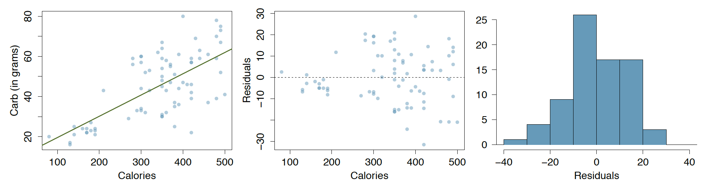
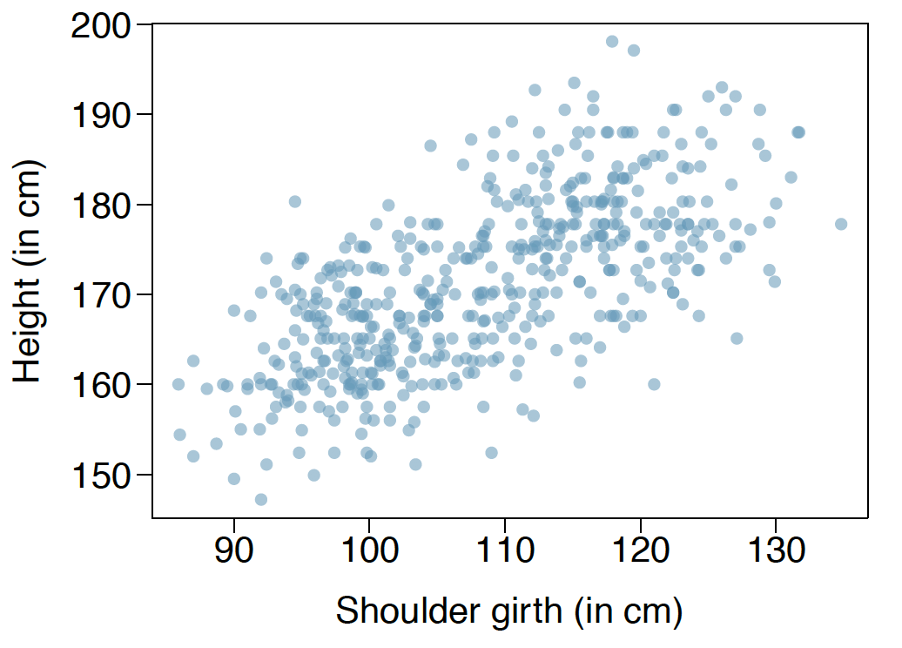
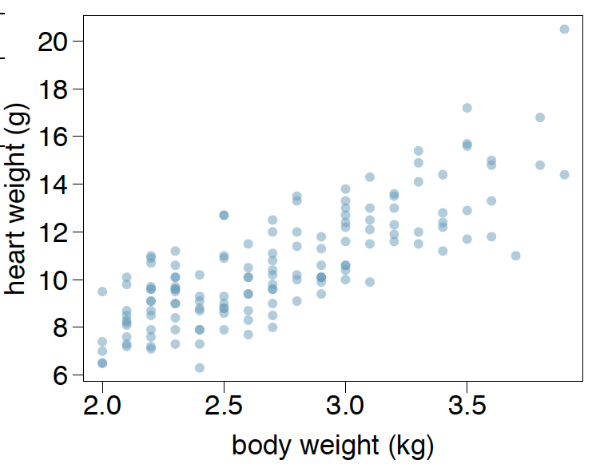
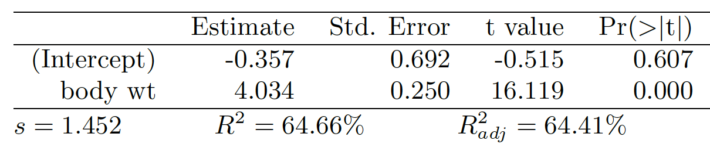
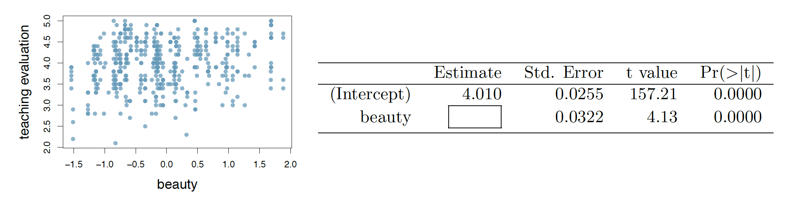
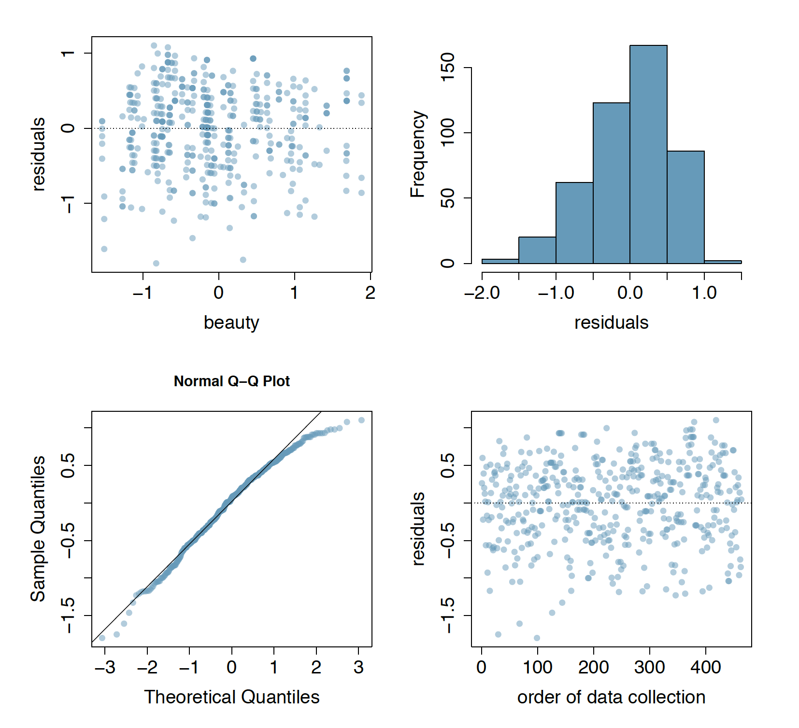

```{r setup, include=FALSE}
knitr::opts_chunk$set(echo = TRUE)
```

#INTRODUCTION TO LINEAR REGRESSION

###7.24 Nutrition at Starbucks, Part I. 
The scatterplot below shows the relationship between the number of calories and amount of carbohydrates (in grams) Starbucks food menu items contain. 21 Since Starbucks only lists the number of calories on the display items, we are interested in predicting the amount of carbs a menu item has based on its calorie content.



(a) Describe the relationship between number of calories and amount of carbohydrates (in grams) that Starbucks food menu items contain.

The relationship seems to be positively linear, with carbs increasing as calories increase.

(b) In this scenario, what are the explanatory and response variables?

Calories is the explanatory variable and Carb (in grams) is the response variable.

(c) Why might we want to fit a regression line to these data?

We would fit a regression line in order to be able to calculate the amount of carbs given the calories for values other than those in the dataset.

(d) Do these data meet the conditions required for fitting a least squares line?

Conditions which should be met are:    
*Linearity:* data in this case does show a positive linear trend.   
*Nearly Normal residuals:* the distributions seems to be slightly right skew, but in general it does seem to be normal.     
*Constant variability:* data in this case doesn't seem to be completely constantly variable. Residuals on the far right are substantially larger than on the left side. This suggest a linear regression might not be the best fit.      
*Independent Observations:* here it is not possible to determine independence of the variables. As we see in the residuals plot, because they are larger towards the right, it seems there is a dependence between the variables. Larger values of calories have larger residuals against the response variable Carb.    


###7.26 Body measurements, Part III. 
Exercise 7.15 introduces data on shoulder girth and
height of a group of individuals. The mean shoulder girth is 107.20 cm with a standard deviation
of 10.37 cm. The mean height is 171.14 cm with a standard deviation of 9.41 cm. The correlation
between height and shoulder girth is 0.67.

(a) Write the equation of the regression line for predicting height.

\[
  \hat{height} = \beta_{0} + \beta_{1} * shouldergirth   
\]
\[
  b_{1} = s_{y} / s_{x} * R = 9.41 / 10.37 * 0.67 = 0.608
\]
\[
  y - y_{0} = b_{1} * (x - x_{0})
\]
\[
  y - 171.14 = 0.608 * (x - 107.20)
\]
\[
  y = 0.608 * x - 0.608 * 107.20 + 171.14 = 105.9624 + 0.608 * x
\]
\[
  \hat{height} = 105.9624 + 0.608 * shouldergirth 
\]

(b) Interpret the slope and the intercept in this context.

Slope is positive, so the larger the shoulder grit, the higher the individual. The intercept doesn't apply within this context as it tells us that for no shoulder grit, the individual has a height of 105.9624.

(c) Calculate R2 of the regression line for predicting height from shoulder girth, and interpret it
in the context of the application.

\[
R^{2} = 0.67^{2} = 0.4489
\]
This tells us that 44.89% of the variability in height is explained by shoulder grit.

(d) A randomly selected student from your class has a shoulder girth of 100 cm. Predict the height
of this student using the model.

\[
  \hat{height} = 105.9624 + 0.608 * shouldergirth = 105.9624 + 0.608 * 100 = 166.7624
\]

(e) The student from part (d) is 160 cm tall. Calculate the residual, and explain what this residual
means.

\[
  e_{100} = 160 - 166.7624 = -6.7624
\]

This means we have overestimated the height of the student by -6.7624


(f) A one year old has a shoulder girth of 56 cm. Would it be appropriate to use this linear model
to predict the height of this child?

The data for this case is presented in 7.15 and shown below:



As can be seen in the scattered plot, a shoulder grit of 50 is below the lowest shoulder grit in the data. This would mean we would be using the model to extrapolate data, which is not a recommended practice, so it would not be appropriate to use this model.

###7.30 Cats, Part I. 
The following regression output is for predicting the heart weight (in g) of cats
from their body weight (in kg). The coefficients are estimated using a dataset of 144 domestic cats.





(a) Write out the linear model.

\[
  \hat{heartweight} = -0.357 + 4.034 * bodyweight
\]

(b) Interpret the intercept.

The intercept tells us that for a body weight of zero, the heart weight is -0.357 g
In this context, the intercept has no meaning.

(c) Interpret the slope.

It tells us there is a positive relationship between body weight and heart weight. If we increase body weight by 1 Kg, heart weight increases by 4.034 g

(d) Interpret R$^{2}$2.

R$^{2}$2 shows that 64.66% of the variability of heart weight is explained by body weight.

(e) Calculate the correlation coefficient.

Correlation coeficient = R  -> $\sqrt{R^{2}}$ = $\sqrt{0.6466}$ = 0.8041144

###7.40 Rate my professor. 
Many college courses conclude by giving students the opportunity
to evaluate the course and the instructor anonymously. However, the use of these student evaluations
as an indicator of course quality and teaching effectiveness is often criticized because these
measures may reflect the influence of non-teaching related characteristics, such as the physical appearance
of the instructor. Researchers at University of Texas, Austin collected data on teaching
evaluation score (higher score means better) and standardized beauty score (a score of 0 means
average, negative score means below average, and a positive score means above average) for a
sample of 463 professors. The scatterplot below shows the relationship between these variables,
and also provided is a regression output for predicting teaching evaluation score from beauty score.



(a) Given that the average standardized beauty score is -0.0883 and average teaching evaluation
score is 3.9983, calculate the slope. Alternatively, the slope may be computed using just the
information provided in the model summary table.

\[
  \hat{y} = 4.010 + \beta_{1} * x 
\]
\[
  3.9983 = 4.010 + \beta_{1} * -0.0883 
\]
\[
  \beta_{1} = (3.9983 - 4.010) / -0.0883 = 0.1325028
\]

(b) Do these data provide convincing evidence that the slope of the relationship between teaching
evaluation and beauty is positive? Explain your reasoning.

Yes, although very small it is positive. The regression's p-value is shown to be ~0. Using hypotheis testing where our null is that the slope is zero, a small p-value as the indicated means we reject the null and conclude that there is evidence that the slope is not zero.

(c) List the conditions required for linear regression and check if each one is satisfied for this model
based on the following diagnostic plots.



We use the provided graphs to check the following conditions:       
*Linearity:* the scattered plot of beauty and teaching evaluation shows positive linearity, although with a very small slope.   
*Nearly Normal residuals:* the distribution plot of residuals shows very normal, maybe with a very slight left skew. The probability plot also shows normality, with most data falling on top of the line, especially in the center.        
*Constant variability:* The residuals scattered plot does not show any pattern. We see a very constant variability for all values left to right.         
*Independent Observations:* there is no indications of dependance, with residuals showing constant variability. 


